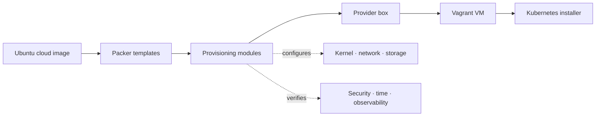
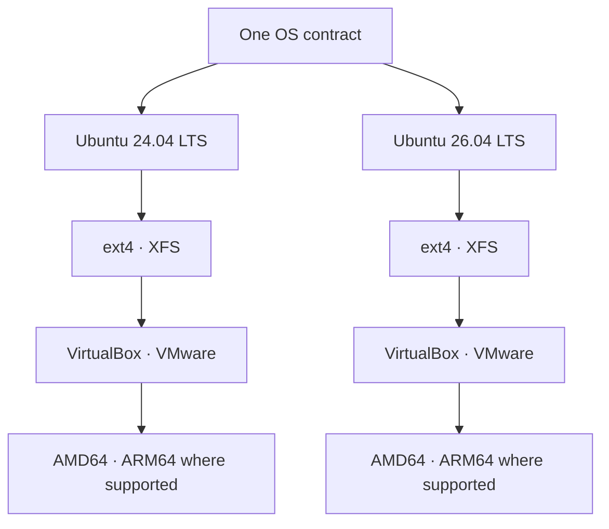

# Architecture

Kube Ready Box produces reproducible, Kubernetes-ready VM images. It prepares the operating-system substrate; it deliberately does not install a container runtime, Kubernetes, or a CNI.

## Build and consumption flow

The product boundary is the provider box and its verified OS contract. Cluster lifecycle remains owned by the consuming project.

## Repository layers

| Layer | Source | Responsibility |
|---|---|---|
| Image definition | `packer/` | Ubuntu release, architecture, provider and filesystem matrix |
| OS contract | `packer/scripts/`, `etc/` | Kernel modules, sysctl, limits, packages and boot-time disk expansion |
| Capability modules | `network/`, `storage/`, `security/`, `time/`, `observability/` | Focused host configuration and checks |
| Validation | `test-vm/`, `tools/`, `rust/kube-ready-verifier/` | Provider boot tests and machine-readable tuning verification |
| Release evidence | `release-evidence/`, GitHub Actions | Records which provider artifacts passed release gates |

## Artifact matrix

Provider availability is constrained by runner and hypervisor support; the current published matrix is maintained in the [README](../README.md#build-matrix).

## Runtime boundary

At first boot, the image expands its thin-provisioned disk and exposes a consistent Linux host contract. Consumers then install containerd or CRI-O, Kubernetes and their chosen CNI. This separation lets cluster projects reuse the host foundation without coupling this repository to a Kubernetes distribution.

## Architecture invariants

- The image is Kubernetes-ready, not a prebuilt cluster.
- AMD64 and ARM64 follow the same OS contract; provider exceptions are documented.
- ext4 and XFS are separate artifacts because filesystem behavior is observable.
- Every published provider artifact must have matching validation evidence.
- Version claims and build inputs remain traceable through [build inputs](build-inputs.md) and [evidence contracts](evidence-contracts.md).

